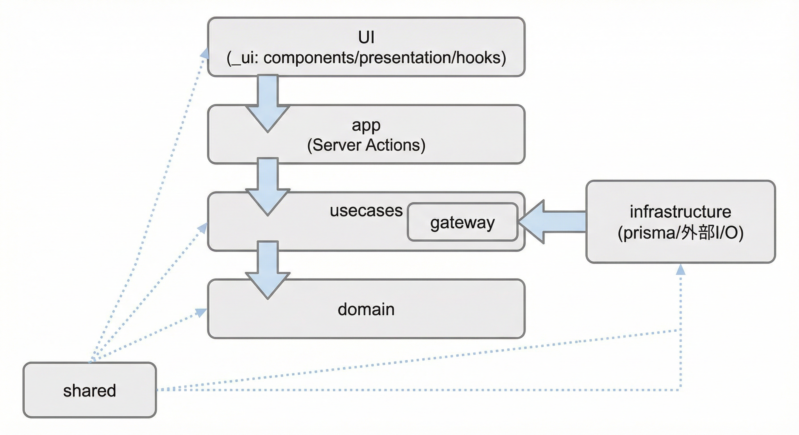
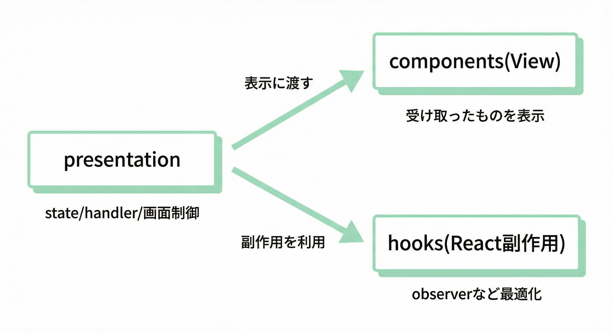

---

# Architecture Overview

本プロジェクトは **Next.js(App Router) をフルスタック基盤**として利用し、
フロントエンド／バックエンドを分離せずfeature単位の **1つのコードベースでクリーンアーキテクチャを実現**する。

「関数型 + クリーンアーキ」

目的は以下：

* 1週間以内で実装可能なスピード
* TypeScript + 関数型志向
* feature 単位で独立・削除・拡張しやすい構造
* Server Component / Server Actions を最大限活用

---

---

## 設計意図（Why this architecture）

本アプリは **社内セキュリティ訓練**という性質上、
「短期間で作れること」と同時に「拡張・運用・安全性」を考慮した設計を重視している。

そのため、以下の思想に基づいてアーキテクチャを構築している。

---

### 1. feature 単位で完結する構造を採用した理由

本プロジェクトでは、`features/*` 配下に **domain / usecases / infrastructure / UI をすべて閉じ込める**
「feature丸ごと構成」を採用している。

これにより：

* 機能単位で **理解・修正・削除が容易**
* 将来的に feature を別アプリ／別サービスに切り出しやすい
* コンテスト用MVPから実運用へのスケール時に破綻しにくい

というメリットがある。

---

### 2. クリーンアーキテクチャをフロントエンドまで貫く理由

フロントエンドにおいても以下を明確に分離している：

* **domain**：値とルール（純粋関数）
* **usecases**：何をするか（業務フロー）
* **infrastructure**：DBや外部I/O（副作用）
* **UI**：表示・UX

これは以下を目的としている：

* UIやフレームワークの変更が **業務ロジックに影響しない**
* テストしやすい（usecase/domainは純粋関数）
* セキュリティ訓練ロジックが「画面」に埋もれない

---

### 3. Next.js を「フルスタック基盤」として使う理由

本アプリでは Next.js(App Router) を **フロントエンド + バックエンド両方**として利用している。

* Server Components / Server Actions により
  * DBアクセスを完全にサーバー側に閉じる
  * APIレイヤを別途用意せずに済む
* UI と API の距離が近く、MVP開発が高速

これは **1週間以内での開発**という制約に最適でありつつ、
後から NestJS 等の専用バックエンドに切り出すことも可能な構成になっている。

---

### 認証・認可の方針

- App Router + Auth.js (NextAuth) v5 を採用し、Prisma Adapter で `users` を永続化
- パスワードレス前提：Google OAuth / LINE Login を利用（メール取得権限を確保）
- セッション/JWT に `role`（admin/user）を含め、`middleware.ts` で `/admin/**` をロールチェック
- `/learn/*` と `/t/*` はゲスト許可、それ以外はログイン必須
- 重要操作（承認・配信・停止）はセッションから userId を引いて監査テーブルに記録

### 4. Server Actions をバックエンドAPIとして扱う理由

`app/**/actions.ts` を **バックエンドAPI相当**として扱うことで：

* 認証情報・DB接続をクライアントに出さない
* 型安全に UI → サーバー処理をつなげられる
* フォーム送信や状態管理が単純になる

特に `useActionState` を用いることで、

* バリデーションエラー
* 業務エラー
* 成功状態

を **単一の状態遷移**として UI に反映できる。

---

### 5. zod を UI / Server Action で共有する理由

zod は **UI と Server Action で共通の入力検証**として位置付けている。

* 入力中・blur時の即時フィードバック（UI）
* Server Action での再検証（サーバー）
* エラーメッセージ生成

ただし、**最終的な正しさは domain/usecase 側で保証**する。

これにより：

* UX と安全性の責務を分離
* クライアント改変・不正リクエストにも耐性を持つ

---

### 6. 共通コードと feature 専用コードを分ける理由

再利用範囲に応じて配置を分けている：

* feature 専用：
  * `features/**/_ui`（components/presentation/hooks）
  * `features/**/validators`
  * `features/**/contracts`
* 複数 feature 共通：
  * `shared/*`

これにより：

* 「とりあえず共通に置く」ことで肥大化しない
* feature の独立性が保たれる
* 共通化の判断基準が明確になる

---

### 7. ローカル環境を重視した理由

本プロジェクトは：

* Docker / Podman でローカル完結
* Next.js + Prisma + Postgres のみで動作

という構成を採用している。

* コンテスト参加者・レビュアーが **すぐ動かせる**
* 外部サービス依存を最小限に抑えられる
* 後から Redis / Queue / メール送信を追加しやすい


## まとめ

このアーキテクチャは、

* **短期間での開発**
* **セキュリティ訓練アプリとしての信頼性**
* **将来的な拡張・運用**

のバランスを重視して設計されている。

MVPとして成立しつつ、
実運用・組織導入にも耐えうる構造を目指している。

---


## 全体構成

```
src/
  app/                    # Next.js routing layer（薄く保つ）
    enroll/
      page.tsx            # Server Component
      actions.ts          # Server Actions（バックエンドAPI相当）

  _di/                    # 依存関係の組み立て（ルーティング対象外）
    container.server.ts

  features/               # feature 単位で完結する実装
    enroll/
      contracts/          # UI/Server Action間の入出力契約
      validators/         # zod schema（UI/Server Actionで共有）
      domain/             # 値オブジェクト・純粋関数
      usecases/           # アプリケーションロジック
        dto/              # usecase入出力DTO
        gateway/          # 外界に求める interface（Repository等）
      infrastructure/     # DB/外部I/O（副作用）
        prisma/           # Prisma実装/Mapper
      _ui/                # UI（feature専用）
        components/       # 表示(View): 受け取ったものを表示するだけ
        presentation/     # UI制御ロジック: state/handler/画面制御
        hooks/            # React副作用/最適化: observer等
        index.ts          # 公開エントリ
      tests/              # feature に閉じたテスト
        unit/             # domain/validators 等の純粋テスト
        usecase/          # gateway モックで DTO 入出力を確認
        infrastructure/   # Prisma 実装の統合テスト
        server-actions/   # 対応 Server Action の橋渡し検証
        ui/               # presentation/components の状態遷移
        e2e/              # 当該 feature の E2E（screen ID 単位）

  shared/                 # 複数featureで再利用する共通コード
    fp/                   # Result型などの純粋関数
    validators/           # zod schema の部品
    ui/                   # 共通UIコンポーネント
```

## レイヤ責務

依存方向の概要：



---

### app/

* **ルーティングとServer Actions専用**
* UIやビジネスロジックを持たない
* Server Action を定義し、featureの usecase を呼び出す

---


### _di/

* **依存関係の組み立て**
* feature ごとの container を compose する
* server / client を明示的に分けられる設計

container = DI（依存性注入）用の組み立てオブジェクト

具体的には、各featureのrepository実装などを束ねて、usecaseに注入するための「依存関係の配線」です。

createContainer()がfeatureごとのcontainerをまとめて返し、Server Actionなどから利用されます。

---


### feature/

```
features/***/
  contracts/       # UI/Server Action間の入出力契約
  validators/      # zod schema（UI/Server Actionで共有）
  domain/          # 値オブジェクト・ドメインルール
  usecases/        # 何をするか（DIしやすい関数）
    dto/           # usecase入出力DTO
    gateway/       # Repository等のinterface
  infrastructure/  # Prisma等の実装
    prisma/        # Prismaの実装
  _ui/             # feature専用UI
    components/    # 表示（View）
    presentation/  # UI制御ロジック
    hooks/         # React副作用/最適化
```

#### contracts/

contractsは、他のアプリケーションで言うところのAPIのインターフェースに相当

* **UI/Server Action間の入出力契約**を型で定義
* Server Actionの戻り値の型（例：`EnrollActionState`）
* UIとServer Actionの間で共有される型定義
* `useActionState`の状態型として使用される

具体的には：

1) Server Action側 (app/enroll/actions.ts):
- EnrollActionState型を返すことを約束
- 戻り値の型として使用

2) UI側 (EnrollForm.tsx):
- useActionStateで同じEnrollActionState型を受け取る
- この型に基づいて状態を処理


#### validators/

* **zod schema（UI/Server Actionで共有）**
* フォーム入力の検証ルールを定義
* UI側での即時バリデーション（onBlur/onChange）とServer Action側での再検証の両方に使用
* `shared/validators`の部品を組み合わせてfeature固有のスキーマを構築

#### domain/

* React / fetch / zod を **一切知らない**
* 値オブジェクト、純粋関数のみ
* 例：Email型、バリデーションロジック

#### usecases/

* アプリケーションの振る舞い
* Interactor / UseCase型 / DTO を配置
* gateway/ に外界へのinterface（Repository等）を定義
* UI・DB・フレームワーク非依存

#### infrastructure/

* DB（Prisma）、外部API、I/Oの実装
* usecases/gateway を満たす具体実装
* `infrastructure/prisma` にRepository/Mapperを置く
* エラー変換や例外吸収もここで行う

#### _ui/

* feature専用のUI
* 表示(View)・制御(Presentation)・副作用(Hooks)を分離して保守性を高める
* components/: 受け取ったものを表示するだけ
* presentation/: state/handlerなどUI制御ロジック
* hooks/: React副作用や最適化（observer等）
* Server Actions と連携

UI内の分割イメージ：



---

### shared/

* **複数featureで再利用する共通コード置き場**
* 画面やドメインの都合が混ざらないよう最小限に保つ
* 例：`shared/fp`（Result型など）、`shared/validators`（zod部品）、`shared/ui`（共通UI）


---


## UIとバリデーション方針

* **zod は UI / Server Action で共有**

  * 即時バリデーション（onBlur / onChange）
  * Server Action での再検証
* **domain/usecase でも最終検証は行う**

  * zod は UX、domain は安全性

```
features/**/
  validators/   # feature固有のzod schema（UI/Server Actionで共有）
shared/
  validators/   # email / consent 等の共通schema部品
```

---

## Server Actions をバックエンドとして利用

* `app/**/actions.ts` が **バックエンドAPI相当**
* Client Component → Server Action → usecase → repository
* DBアクセスは **必ずサーバー側**

```
Client(UI)
  ↓
Server Action (Next.js)
  ↓
usecase (feature)
  ↓
Repository (Prisma)
```

---

## 状態管理とフォーム

* フォームは `useActionState` を使用
* Server Action の戻り値を state としてUIに反映
* エラーは以下をマージ表示：

  * クライアント即時（zod）
  * サーバー検証結果（正）

---

## 共通部品の配置ルール

| 種類              | 配置                          |
| --------------- | --------------------------- |
| UI表示(View)       | `features/**/_ui/components` |
| UI制御ロジック        | `features/**/_ui/presentation` |
| UI副作用(React)    | `features/**/_ui/hooks`     |
| feature専用validator | `features/**/validators`     |
| feature入出力契約     | `features/**/contracts`      |
| 複数featureで再利用   | `shared/ui`                 |
| 共通validator部品   | `shared/validators`         |
| 共通純粋ロジック        | `shared/fp`                 |

---

## この構成のメリット

* feature単位で **丸ごと削除・移動可能**
* UI / ドメイン / I/O が明確に分離
* Server Component / Server Actions を最大活用
* NestJS 等の別バックエンドへ **移行しやすい**
* コンテスト用MVP〜実運用までスケール可能

---

## 想定技術スタック

* Next.js (App Router)
* TypeScript
* Server Components / Server Actions
* Prisma + PostgreSQL
* zod
* Docker / Podman（ローカル実行）

---
