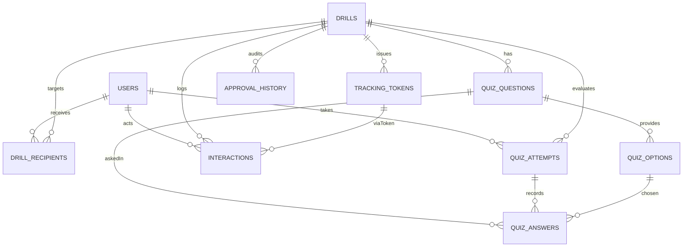

# データベース構成（database.md）

## 目次
- [データベース構成（database.md）](#データベース構成databasemd)
  - [目次](#目次)
  - [目的](#目的)
  - [設計ポリシー](#設計ポリシー)
  - [ER 図（概念）](#er-図概念)
  - [テーブル定義](#テーブル定義)
    - [ユーザーを保持する理由（運用メモ）](#ユーザーを保持する理由運用メモ)
    - [users](#users)
    - [drills](#drills)
    - [tracking\_tokens](#tracking_tokens)
    - [drill\_recipients](#drill_recipients)
    - [delivery\_channels](#delivery_channels)
    - [interactions](#interactions)
    - [quiz\_questions](#quiz_questions)
    - [quiz\_options](#quiz_options)
    - [quiz\_attempts](#quiz_attempts)
    - [quiz\_answers](#quiz_answers)
    - [approval\_history](#approval_history)
    - [opt\_out\_requests](#opt_out_requests)
  - [画面要件との対応](#画面要件との対応)
  - [インデックス指針（集計・画面表示の高速化）](#インデックス指針集計画面表示の高速化)
  - [将来拡張の余地](#将来拡張の余地)
  - [運用・マイグレーションメモ](#運用マイグレーションメモ)

## 目的
- 画面仕様（`screenConfiguration.md`）を実現するためのテーブル構成とリレーションを定義する。
- 訓練の作成・配信・行動計測・クイズ・オプトアウトまでを一貫して追跡できることを重視。

## 設計ポリシー
- 監査性: ステータス遷移や配信・行動ログを履歴テーブルで保持。
- 多チャネル対応: 配信チャネル（メール/Slack 等）をマスターで管理し、将来のチャネル追加にも備える。
- 冪等性: トラッキング用 token はユニーク制約で重複生成を防ぐ。
- 拡張性: シナリオ（将来機能）やジョブ管理に拡張しやすい正規化構造。

## ER 図（概念）

## テーブル定義

### ユーザーを保持する理由（運用メモ）
- クリック・学習・クイズ結果を誰が実施したか紐づける恒久IDが必要（再受験・累積分析・個別フィードバック）。
- 配信先管理（メール/Slack）、オプトアウト、再送/停止時に宛先マスターが必須。
- 承認履歴・配信・行動ログの actor/target を一意に示し、監査性を確保。
- 認可をシンプルにする：`role=admin` 以外は `user` として扱い、UI上はゲスト表示でも ID は保持。
- 将来拡張（シナリオ推奨、SAML/OIDC 連携、Slack thread 返信紐づけなど）でもキーとして利用。

### users
目的: ログインユーザー・訓練対象者のマスター（Admin/User/Guest ロールはセッション側で付与想定）  
主キー: `id` (UUID)

| カラム | 型 | 制約 | 説明 |
| --- | --- | --- | --- |
| id | uuid | PK | ログイン・紐付け用 |
| email | varchar | unique, not null | メール配信の宛先兼ログイン識別 |
| consented_at | timestamptz | nullable | 訓練参加への同意取得日時 |
| slack_user_id | varchar | unique, nullable | Slack 配信の宛先 |
| role | enum(admin,user) | @default("user") | 管理権限判定用 |
| opted_out | bool | @default(false) | 配信停止フラグ |
| opt_out_reason | text | nullable | 停止理由の自由記述 |
| opted_out_at | timestamptz | nullable | 停止日時 |
| created_at | timestamptz | @default(now()) | 監査（作成） |
| updated_at | timestamptz | @updatedAt | 監査（更新） |

| インデックス | カラム | 種別/用途 |
| --- | --- | --- |
| idx_users_email | email | unique |
| idx_users_slack_user_id | slack_user_id | unique（NULL は複数可） |

### drills
目的: 訓練の本体。生成された文面・クイズ・配信状態を管理  
主キー: `id` (UUID)

| カラム | 型 | 制約 | 説明 |
| --- | --- | --- | --- |
| id | uuid | PK |  |
| title | varchar | not null | 訓練名（一覧表示） |
| scenario_id | varchar | nullable | MVPはシナリオコード、将来はシナリオマスター参照 |
| status | enum(draft,deliverable,delivering,sent,stopped,failed) | @default("draft") | 配信フロー管理 |
| channel | varchar | not null | 配信チャネルコード（delivery_channels.code を想定） |
| subject | varchar | not null | メール件名 |
| body | text | not null | メール本文（HTML/プレーン想定） |
| guidance_text | text | not null | 誘導文面（ランディング誘導） |
| scheduled_at | timestamptz | nullable | 予約配信時刻 |
| sent_at | timestamptz | nullable | 配信完了時刻 |
| created_by | uuid | FK -> users.id | 作成者 |
| updated_by | uuid | FK -> users.id, nullable | 最終更新者 |
| created_at | timestamptz | @default(now()) | 監査（作成） |
| updated_at | timestamptz | @updatedAt | 監査（更新） |

| インデックス | カラム | 種別/用途 |
| --- | --- | --- |
| idx_drills_status | status | 絞り込み |
| idx_drills_channel | channel | 絞り込み（チャネルコード） |
| idx_drills_sent_at | sent_at desc | 一覧の最新順 |

### tracking_tokens
目的: `/t/[token]` でのクリック計測用トークン。drill と 1:N  
主キー: `id` (UUID)

| カラム | 型 | 制約 | 説明 |
| --- | --- | --- | --- |
| id | uuid | PK |  |
| drill_id | uuid | FK -> drills.id | 発行元ドリル |
| drill_recipient_id | uuid | FK -> drill_recipients.id, nullable | 対象ユーザー（任意） |
| token | varchar | unique, not null | クリック計測用ランダム文字列 |
| expires_at | timestamptz | nullable | 期限切れ対応 |
| is_active | bool | @default(true) | 無効化フラグ |
| created_at | timestamptz | @default(now()) | 発行日時 |

| インデックス | カラム | 種別/用途 |
| --- | --- | --- |
| idx_tracking_tokens_token | token | unique |
| idx_tracking_tokens_drill_id | drill_id |  |

### drill_recipients
目的: 訓練対象者と配信チャネルの関係、送信結果、個別状態を保持  
主キー: `id` (UUID)

| カラム | 型 | 制約 | 説明 |
| --- | --- | --- | --- |
| id | uuid | PK |  |
| drill_id | uuid | FK -> drills.id | 対象ドリル |
| user_id | uuid | FK -> users.id | 対象ユーザー |
| delivery_channel_id | uuid | FK -> delivery_channels.id | 個別チャネル |
| delivery_status | enum(pending,scheduled,sent,failed,bounced,cancelled) | @default("pending") | 送信結果 |
| delivery_error | text | nullable | 失敗理由詳細 |
| delivered_at | timestamptz | nullable | 送信完了時刻 |
| clicked_at | timestamptz | nullable | トークン踏み時刻 |
| learned_at | timestamptz | nullable | 学習ページ到達時刻 |
| created_at | timestamptz | @default(now()) | 作成 |

| 制約 | 内容 |
| --- | --- |
| unique (drill_id, user_id, delivery_channel_id) | 同一チャネル重複防止 |

| インデックス | カラム | 種別/用途 |
| --- | --- | --- |
| idx_drill_recipients_drill | drill_id | 絞り込み |
| idx_drill_recipients_user | user_id | ユーザー詳細 |
| idx_drill_recipients_status | delivery_status | 配信状況集計 |
| idx_drill_recipients_channel | delivery_channel_id | チャネル別集計 |

### delivery_channels
目的: 配信チャネルのマスター。メール/Slack/LINE/SMS などを柔軟に追加・停止可能にする。  
主キー: `id` (UUID)

| カラム | 型 | 制約 | 説明 |
| --- | --- | --- | --- |
| id | uuid | PK |  |
| code | varchar | unique, not null | チャネルコード（例: email, slack, line, sms） |
| name | varchar | not null | 表示名 |
| is_active | bool | @default(true) | 利用可否 |
| metadata | jsonb | nullable | APIキーやエンドポイント等の設定格納用 |
| created_at | timestamptz | @default(now()) |  |
| updated_at | timestamptz | @updatedAt |  |

| インデックス | カラム | 種別/用途 |
| --- | --- | --- |
| idx_delivery_channels_code | code | unique |

### interactions
目的: 行動ログ（送信、クリック、学習到達、クイズ開始/提出など）を時系列で保持  
主キー: `id` (UUID)

| カラム | 型 | 制約 | 説明 |
| --- | --- | --- | --- |
| id | uuid | PK |  |
| drill_id | uuid | FK -> drills.id |  |
| user_id | uuid | FK -> users.id, nullable | 匿名クリックを許容 |
| tracking_token_id | uuid | FK -> tracking_tokens.id, nullable |  |
| type | enum(send,click,learn,quiz_start,quiz_submit,complete,opt_out) | not null | 行動種別 |
| metadata | jsonb |  | UA/IP/チャネル/score 等の付帯情報 |
| occurred_at | timestamptz | @default(now()) | 発生時刻 |

| インデックス | カラム | 種別/用途 |
| --- | --- | --- |
| idx_interactions_drill_type_time | drill_id, type, occurred_at desc | 一覧・集計 |
| idx_interactions_user_time | user_id, occurred_at desc | ユーザー詳細 |

### quiz_questions
目的: 訓練ごとのクイズ問題  
主キー: `id` (UUID)

| カラム | 型 | 制約 | 説明 |
| --- | --- | --- | --- |
| id | uuid | PK |  |
| drill_id | uuid | FK -> drills.id |  |
| order | int | not null | 出題順（昇順表示） |
| question_type | enum(single_choice,multiple_choice,text) | @default("single_choice") | 出題形式（ラジオ/チェック/記述） |
| question_text | text | not null | 問題文 |
| explanation | text | not null | 正解解説（学習ポイント） |
| created_at | timestamptz | @default(now()) |  |

| インデックス | カラム | 種別/用途 |
| --- | --- | --- |
| idx_quiz_questions_drill_order | drill_id, order | 出題順取得 |

### quiz_options
目的: 選択肢  
主キー: `id` (UUID)

| カラム | 型 | 制約 | 説明 |
| --- | --- | --- | --- |
| id | uuid | PK |  |
| question_id | uuid | FK -> quiz_questions.id |  |
| label | varchar | not null | "A","B" 等の表示ラベル |
| option_text | text | not null | 選択肢本文 |
| is_correct | bool | @default(false) | 正解フラグ |

| インデックス | カラム | 種別/用途 |
| --- | --- | --- |
| idx_quiz_options_question | question_id |  |
| idx_quiz_options_correct | question_id, is_correct | 正解検索 |

### quiz_attempts
目的: 受験履歴（再受験を想定し複数レコード許可）  
主キー: `id` (UUID)

| カラム | 型 | 制約 | 説明 |
| --- | --- | --- | --- |
| id | uuid | PK |  |
| drill_id | uuid | FK -> drills.id |  |
| user_id | uuid | FK -> users.id |  |
| attempt_no | int | not null | ユーザーごとの連番（1,2,3...） |
| score | int | @default(0) | 0-100 点 |
| is_passed | bool |  | 合否 |
| started_at | timestamptz | @default(now()) | 受験開始 |
| submitted_at | timestamptz | nullable | 提出時刻 |
| feedback | jsonb | nullable | LLM 分析結果（弱点/助言など） |

| 制約 | 内容 |
| --- | --- |
| unique (drill_id, user_id, attempt_no) | 再受験連番 |

| インデックス | カラム | 種別/用途 |
| --- | --- | --- |
| idx_quiz_attempts_user_drill | user_id, drill_id, submitted_at desc | 履歴 |
| idx_quiz_attempts_passed | drill_id, is_passed | 合格率集計 |

### quiz_answers
目的: 各 attempt の回答内容を保持  
主キー: `id` (UUID)

| カラム | 型 | 制約 | 説明 |
| --- | --- | --- | --- |
| id | uuid | PK |  |
| attempt_id | uuid | FK -> quiz_attempts.id |  |
| question_id | uuid | FK -> quiz_questions.id |  |
| selected_option_id | uuid | FK -> quiz_options.id, nullable | 単一選択用（radio） |
| selected_option_ids | jsonb | nullable | 複数選択用（checkbox, option_id配列） |
| text_answer | text | nullable | 記述式回答 |
| is_correct | bool |  | 回答が正解か |

| 制約 | 内容 |
| --- | --- |
| unique (attempt_id, question_id) | 同問1回答 |

| インデックス | カラム | 種別/用途 |
| --- | --- | --- |
| idx_quiz_answers_attempt | attempt_id |  |
| idx_quiz_answers_question | question_id |  |

### approval_history
目的: 訓練の承認フローやステータス変更の監査ログ  
主キー: `id` (UUID)

| カラム | 型 | 制約 | 説明 |
| --- | --- | --- | --- |
| id | uuid | PK |  |
| drill_id | uuid | FK -> drills.id |  |
| action | enum(submit,approve,reject,stop,fail) | not null | ステータス変更種別 |
| actor_user_id | uuid | FK -> users.id | 実行者 |
| note | text | nullable | コメントや理由 |
| created_at | timestamptz | @default(now()) |  |

| インデックス | カラム | 種別/用途 |
| --- | --- | --- |
| idx_approval_history_drill | drill_id, created_at desc | 履歴参照 |

### opt_out_requests
目的: オプトアウト申請と管理者による解除ログ  
主キー: `id` (UUID)

| カラム | 型 | 制約 | 説明 |
| --- | --- | --- | --- |
| id | uuid | PK |  |
| user_id | uuid | FK -> users.id |  |
| reason | text | nullable | 停止理由 |
| status | enum(requested,accepted,revoked) | @default("requested") | 申請・承認・解除 |
| requested_at | timestamptz | @default(now()) | 申請時刻 |
| updated_at | timestamptz | @updatedAt | 状態更新時刻 |

| インデックス | カラム | 種別/用途 |
| --- | --- | --- |
| idx_opt_out_user | user_id, requested_at desc | 状態管理 |

## 画面要件との対応
- 参加者登録 (`/admin/enroll`): `users`, `drill_recipients`（チャネル指定）、`opt_out_requests`。
- 訓練作成/編集 (`/admin/drills/create`, `/admin/drills/[id]/edit`): `drills`, `tracking_tokens`, `quiz_questions`, `quiz_options`, `approval_history`。
- 訓練一覧/詳細 (`/admin/drills`, `/admin/drills/[id]`): `drills` + `interactions` + `quiz_attempts`。
- クリック計測 (`/t/[token]`): `tracking_tokens`, `interactions`, `drill_recipients.clicked_at` 更新。
- 学習/クイズ (`/learn/[drillId]`, `/learn/[drillId]/quiz`): `interactions`, `quiz_attempts`, `quiz_answers`。
- 参加者一覧/詳細 (`/admin/users`, `/admin/users/[id]`): `users` + `drill_recipients` + `interactions` + `quiz_attempts`。
- オプトアウト (`/settings/opt-out`): `opt_out_requests`, `users.opted_out*`。

## インデックス指針（集計・画面表示の高速化）
- 一覧系: `drills(sent_at desc)`, `interactions(drill_id, type, occurred_at desc)`, `quiz_attempts(user_id, drill_id, submitted_at desc)`。
- ユーザー詳細: `drill_recipients(user_id)`, `interactions(user_id)`, `quiz_attempts(user_id)`。
- 集計用: `quiz_attempts(drill_id, is_passed)` で合格率計算、`interactions(drill_id, type)` でクリック率/学習率。
- トークン解決: `tracking_tokens(token)` でダイレクト参照。

## 将来拡張の余地
- `scenarios` マスターと `drills.scenario_id` を厳密に紐付け、プロンプトテンプレートやカテゴリを保持（MVPはコード文字列）。
- 配信ジョブ管理テーブル（例: `delivery_jobs`）を追加し、BullMQ/Redis 等と連携。
- Slack 配信結果（thread_ts、エラーコード）を `drill_recipients` の `metadata`（jsonb）で保持。
- IP/UA ログを `interactions.metadata` に保持し、異常検知や評価に利用。

## 運用・マイグレーションメモ
- UUID を全テーブルで採用し、外部キーは ON DELETE CASCADE ではなく基本は RESTRICT（ログ保全優先）。`tracking_tokens` のみ drill 削除時に CASCADE を検討。
- イベントログ（`interactions`）は肥大化しやすいので、定期的なアーカイブまたはパーティショニング（drill_id 単位）を検討。
- クイズ問題・選択肢は配信後に変更される場合があるため、編集時はドラフト状態で上書き or 複製を検討（現在はシンプルに上書き想定）。
